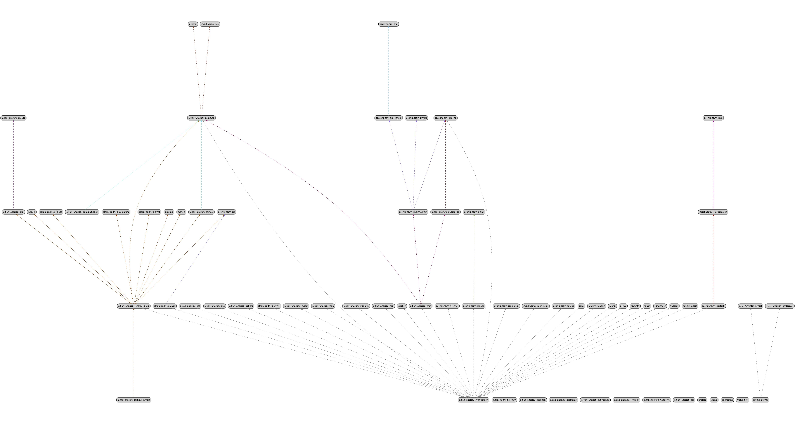

# NABLA Deployment

- Requires Ansible 2.5.0 or newer
- Expects Ubuntu or CentOS/RHEL 6.x hosts

These playbooks deploy a very basic workstation with all the required tool needed for a developper or buildmaster or devops to work on NABLA.
Goal of this project is to integrate of several roles done by the community.
Goal is to contribuate to the community as much as possible instead of creating a new role.
Goal is to ensure following roles (GIT submodules) to work in harmony.

Then run the playbook, like this:

	ansible-playbook -i hosts -c local -v nabla.yml -vvvv
	or
	setup.sh

When the playbook run completes, you should be able to work on any NABLA project, on the target machines.

This is a very simple playbook and could serve as a starting point for more complex projects.

## Install ansible

```
sudo pip2 install ansible==2.4.1.0
```

## Quality tools

See [pre-commit](http://pre-commit.com/)
Run `pre-commit install`

Run `pre-commit run --all-files`

Run `git commit -am 'Add key' --no-verify`

## Docker image

See [ansible-jenkins-slave](https://hub.docker.com/r/nabla/ansible-jenkins-slave-docker/)

### Pull image
```
docker pull nabla/ansible-jenkins-slave
```
### Start container
```
docker run -t -d -w /sandbox/project-to-build -v /workspace/users/albandri30/:/sandbox/project-to-build:rw --name sandbox nabla/ansible-jenkins-slave:latest cat
```
### Build
```
docker exec sandbox /opt/maven/apache-maven-3.2.1/bin/mvn -B -Djava.io.tmpdir=./tmp -Dmaven.repo.local=/home/jenkins/.m2/.repository -Dmaven.test.failure.ignore=true -s /home/jenkins/.m2/settings.xml -f cmr/pom.xml clean install
```

### Stop & remove container
```
docker stop sandbox
docker rm sandbox
```

## Build & development

Run `./run-ansible-workstation.sh` for building like Jenkins.
Run `./setup.sh` for building.
Run `./build.sh` for building docker image.

### Dependency Graph

See ansigenome.conf file in your HOME folder ~.ansigenome.conf and templates in misc/ansigenome/templates



### Ideas for Improvement

Here are some ideas for ways that these playbooks could be extended:

- Test this playbooks on all aservers automatically.
- Write a playbook to deploy an NABLA application into the server.

We would love to see contributions and improvements, so please fork this
repository and send us your changes via pull requests.
